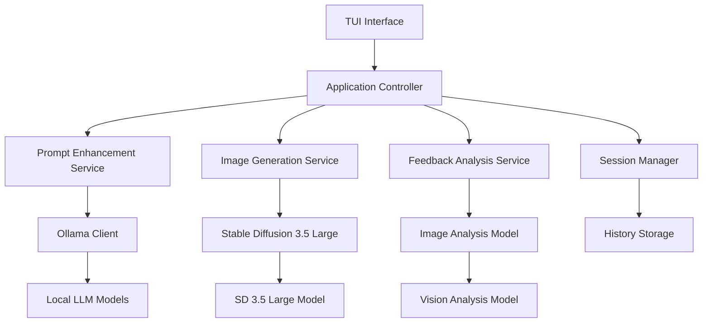

# Design Document

## Overview

mini_museは、Stable Diffusion 3.5 Largeとollamaを活用したTUIベースの画像生成・改善アプリケーションです。ユーザーの簡単な説明から高品質な画像を生成し、AIフィードバックを通じて反復的に改善するワークフローを提供します。

### Key Features
- Ollama統合によるローカルLLMでのプロンプト拡張
- Stable Diffusion 3.5 Largeによる高品質画像生成
- TUIベースの直感的なユーザーインターフェース
- AIによる画像品質フィードバック
- 反復的改善プロセス

## Architecture

### System Architecture



### Technology Stack
- **Language**: Python 3.9+
- **TUI Framework**: Rich/Textual for advanced terminal UI
- **Image Generation**: Diffusers library with Stable Diffusion 3.5 Large
- **LLM Integration**: Ollama Python client
- **Image Processing**: PIL/Pillow, OpenCV
- **Configuration**: YAML/TOML for settings
- **Storage**: JSON for session history

## Components and Interfaces

### 1. TUI Interface Layer

**Main Interface Components:**
- **Welcome Screen**: アプリケーション起動時の初期画面
- **Prompt Input Panel**: ユーザー入力とプロンプト表示
- **Image Display Panel**: 生成画像の表示（ASCII art/sixel対応）
- **Feedback Panel**: AI分析結果とフィードバック表示
- **History Panel**: 過去の生成履歴とイテレーション
- **Settings Panel**: モデル設定と環境設定

**Key Interface Classes:**
```python
class MainApp(App):
    """Main TUI application controller"""
    
class PromptInputWidget(Widget):
    """User input and prompt enhancement display"""
    
class ImageDisplayWidget(Widget):
    """Generated image display with terminal compatibility"""
    
class FeedbackWidget(Widget):
    """AI feedback and suggestions display"""
    
class HistoryWidget(Widget):
    """Session history and iteration management"""
```

### 2. Application Controller

**Core Controller:**
```python
class MiniMuseController:
    """Main application logic coordinator"""
    
    def __init__(self):
        self.prompt_service = PromptEnhancementService()
        self.image_service = ImageGenerationService()
        self.feedback_service = FeedbackAnalysisService()
        self.session_manager = SessionManager()
    
    async def generate_image_workflow(self, user_input: str) -> GenerationResult
    async def analyze_and_feedback(self, image: Image, prompt: str) -> FeedbackResult
    async def iterate_improvement(self, feedback: FeedbackResult) -> str
```

### 3. Prompt Enhancement Service

**Ollama Integration:**
```python
class PromptEnhancementService:
    """Ollama-powered prompt enhancement"""
    
    def __init__(self, model_name: str = "llama3.1"):
        self.ollama_client = OllamaClient()
        self.model_name = model_name
    
    async def enhance_prompt(self, user_input: str, context: dict = None) -> EnhancedPrompt
    async def suggest_improvements(self, original_prompt: str, feedback: str) -> str
    
class EnhancedPrompt:
    original_input: str
    enhanced_prompt: str
    style_tags: List[str]
    technical_params: dict
```

### 4. Image Generation Service

**Stable Diffusion 3.5 Large Integration:**
```python
class ImageGenerationService:
    """SD 3.5 Large image generation"""
    
    def __init__(self):
        self.pipeline = StableDiffusion3Pipeline.from_pretrained(
            "stabilityai/stable-diffusion-3.5-large"
        )
    
    async def generate_image(self, prompt: str, params: GenerationParams) -> GeneratedImage
    async def batch_generate(self, prompts: List[str]) -> List[GeneratedImage]
    
class GenerationParams:
    width: int = 1024
    height: int = 1024
    num_inference_steps: int = 28
    guidance_scale: float = 7.0
    seed: Optional[int] = None
```

### 5. Feedback Analysis Service

**Image Quality Analysis:**
```python
class FeedbackAnalysisService:
    """AI-powered image feedback analysis"""
    
    def __init__(self):
        self.vision_model = self._load_vision_model()
        self.ollama_client = OllamaClient()
    
    async def analyze_image(self, image: Image, prompt: str) -> ImageAnalysis
    async def generate_feedback(self, analysis: ImageAnalysis) -> FeedbackResult
    
class ImageAnalysis:
    composition_score: float
    style_consistency: float
    prompt_adherence: float
    technical_quality: float
    identified_issues: List[str]
    
class FeedbackResult:
    overall_score: float
    strengths: List[str]
    improvements: List[str]
    suggested_prompt_changes: List[str]
```

### 6. Session Manager

**History and State Management:**
```python
class SessionManager:
    """Session state and history management"""
    
    def __init__(self):
        self.current_session = GenerationSession()
        self.storage = HistoryStorage()
    
    async def save_generation(self, result: GenerationResult)
    async def load_session(self, session_id: str) -> GenerationSession
    async def get_iteration_history(self) -> List[GenerationResult]
    
class GenerationSession:
    session_id: str
    created_at: datetime
    generations: List[GenerationResult]
    current_iteration: int
```

## Data Models

### Core Data Structures

```python
@dataclass
class GenerationResult:
    """Complete generation result with metadata"""
    id: str
    timestamp: datetime
    user_input: str
    enhanced_prompt: str
    generated_image: Image
    generation_params: GenerationParams
    feedback: Optional[FeedbackResult] = None
    iteration_number: int = 1
    parent_generation_id: Optional[str] = None

@dataclass
class UserPreferences:
    """User configuration and preferences"""
    default_model: str
    preferred_style: str
    image_format: str
    display_mode: str  # "ascii", "sixel", "external"
    auto_enhance: bool = True
    save_history: bool = True
```

## Error Handling

### Error Categories and Handling

1. **Model Loading Errors**
   - Ollama connection failures
   - Stable Diffusion model loading issues
   - Missing model files

2. **Generation Errors**
   - Prompt processing failures
   - Image generation timeouts
   - Memory limitations

3. **TUI Rendering Errors**
   - Terminal compatibility issues
   - Image display failures
   - Layout rendering problems

4. **Storage Errors**
   - History save/load failures
   - Configuration file issues

**Error Handling Strategy:**
```python
class MiniMuseError(Exception):
    """Base exception for mini_muse"""
    pass

class ModelLoadError(MiniMuseError):
    """Model loading related errors"""
    pass

class GenerationError(MiniMuseError):
    """Image generation related errors"""
    pass

class TUIError(MiniMuseError):
    """TUI rendering related errors"""
    pass

# Graceful error handling with user feedback
async def handle_error(error: Exception, context: str) -> ErrorResponse:
    """Centralized error handling with user-friendly messages"""
    pass
```

## Testing Strategy

### Testing Approach

1. **Unit Tests**
   - Individual service components
   - Data model validation
   - Utility functions

2. **Integration Tests**
   - Ollama client integration
   - Stable Diffusion pipeline
   - TUI component interactions

3. **End-to-End Tests**
   - Complete generation workflow
   - Feedback and iteration cycles
   - Session management

4. **Performance Tests**
   - Model loading times
   - Generation performance
   - Memory usage optimization

### Test Structure
```python
# tests/
# ├── unit/
# │   ├── test_prompt_service.py
# │   ├── test_image_service.py
# │   └── test_feedback_service.py
# ├── integration/
# │   ├── test_ollama_integration.py
# │   └── test_sd_integration.py
# └── e2e/
#     └── test_generation_workflow.py
```

### Mock Strategy
- Mock Ollama responses for consistent testing
- Mock Stable Diffusion generation for faster tests
- Mock TUI interactions for automated testing

## Performance Considerations

### Optimization Strategies

1. **Model Loading**
   - Lazy loading of models
   - Model caching and reuse
   - Memory-efficient model management

2. **Image Generation**
   - Asynchronous generation
   - Batch processing capabilities
   - GPU memory optimization

3. **TUI Rendering**
   - Efficient image-to-ASCII conversion
   - Lazy rendering of large content
   - Responsive UI updates

4. **Storage**
   - Compressed image storage
   - Efficient history indexing
   - Configurable retention policies

### Resource Management
```python
class ResourceManager:
    """Manage system resources efficiently"""
    
    def __init__(self):
        self.gpu_memory_limit = self._detect_gpu_memory()
        self.cpu_cores = self._detect_cpu_cores()
    
    async def optimize_for_hardware(self) -> OptimizationConfig
    async def monitor_resource_usage(self) -> ResourceStats
```